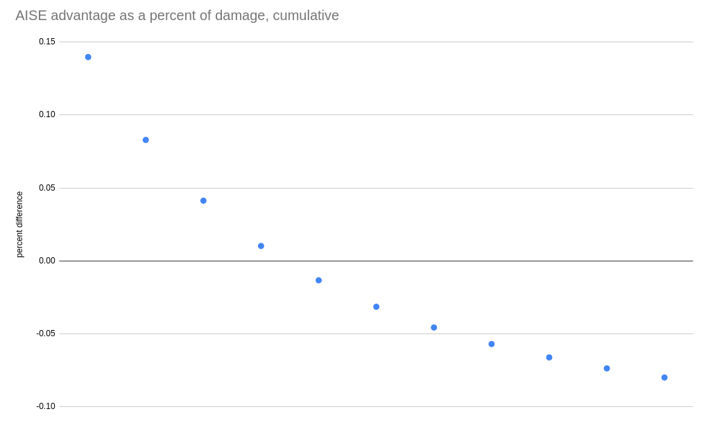

---
tags:
    - data
    - breakpoints
    - gk2
    - scout
    - ai-stability-engine
    - bullets-of-mercy
    - overclock
    - hazard-6
    - hazard-6x2
---

# A Look at GK2 Breakpoints with AI Stability Engine and Bullets of Mercy

| Post Info          |                                                                                                                                                   |
|--------------------|---------------------------------------------------------------------------------------------------------------------------------------------------|
| Author             | u/littlebobbytables9                                                                                                                              |
| Post Date          | 2022-05-29                                                                                                                                        |
| Original Post Link | [A look at gk2 breakpoints with AISE and BoM](https://www.reddit.com/r/technicaldrg/comments/uzy9ua/a_look_at_gk2_breakpoints_with_aise_and_bom/) |

These two OCs are largely considered the only two worth using for the gk2, but some people put AISE
up on the same level as BoM while others do not and I wanted to explore the question quantitatively.

First off, there are some areas where BoM has a clear advantage. White phosphorus makes igniting big
enemies very easy, so you should really never miss out on the 33% damage against praetorians,
wardens, menaces, goo bombers, spitballers, breeders, grabbers, etc. And when you have the extra
damage, BoM is going to do around 15% more DPS assuming all weakpoint hits (I'll address accuracy
near the end). Oppressors don't stay on fire very long, but if you have IFGs it's easy to activate
and even if you don't they're not an especially important enemy anyway.

Where it really comes into question is smaller enemies where it's not worth the effort to ignite
first and then switch weapons- a lot of these are going to die to the boomstick anyway, and if they
don't it's a pretty time- and ammo-inefficient method of killing them. Most of these-
mactera/trijwas and acid/web spitters, are also the targets that best fit under the general scout
role in combat and are also very dangerous, so killing them quickly is important. You'd expect AISE
to do better here, but it's actually a bit more complicated. The reason is that t5 stun lets the BoM
player proc the extra damage just from shooting weakpoints, albeit probabilistically.

{ align=left, loading=lazy }

I made this graph to show the percent difference in cumulative damage compared to BoM as the number
of shots against a target weakpoint increases. For the first shot AISE has a clear advantage doing
14% more damage, but since just the 3rd BoM shot already has a higher expected value than the 3rd
AISE shot, that deficit from the first two shots is basically gone by the 4th shot and past that BoM
is doing more cumulative damage.

The data in the graph is reproduced below, going up to 11 shots because the 12th shot may hit when
stun has worn off, making things more complicated.

| Number of Shots | BoM         | AISE | BoM Cumulative | AISE Cumulative | Percent Difference |
|-----------------|-------------|------|----------------|-----------------|--------------------|
| 1               | 23.4        | 27.2 | 23.4           | 27.2            | 13.97              |
| 2               | 26.4888     | 27.2 | 49.8888        | 54.4            | 8.29               |
| 3               | 28.34208    | 27.2 | 78.23088       | 81.6            | 4.12               |
| 4               | 29.454048   | 27.2 | 107.684928     | 108.8           | 1.02               |
| 5               | 30.1212288  | 27.2 | 137.8061568    | 136             | -1.33              |
| 6               | 30.52153728 | 27.2 | 168.3276941    | 163.2           | -3.1               |
| 7               | 30.76172237 | 27.2 | 199.0894164    | 190.4           | -4.6               |
| 8               | 30.90583342 | 27.2 | 229.9952499    | 217.6           | -6                 |
| 9               | 30.99230005 | 27.2 | 260.9875499    | 244.8           | -6.6               |
| 10              | 31.04418003 | 27.2 | 292.03173      | 272             | -7.4               |
| 11              | 31.07530802 | 27.2 | 323.107038     | 299.2           | -8                 |

So what does this mean? Against enemies with an adjusted health-after-weakpoint-modifier of ~100 or
more (this includes already hurt larger enemies), BoM actually catches back up. Let's look at some
specific enemies, again assuming no activators other than stun, and examine the breakpoints assuming
weakpoint shots (or body shots for enemies where I don't think you can get wp shots consistently,
but those are noted). This also assumes weakpoint damage and both damage upgrades, my preferred
build for both, and uses haz 5 health numbers. Haz 6/7 health scaling will affect the large enemies,
but those are ones for which breakpoints are less relevant, and will also generally favor BoM
because longer strings of hits will benefit much more from stun.

| Enemy         | AISE                                                | BoM                                                                                                                         |
|---------------|-----------------------------------------------------|-----------------------------------------------------------------------------------------------------------------------------|
| mactera spawn | 3 shots                                             | 74% chance of 3 shots, 26% chance of 4 shots                                                                                |
| tri-jaw       | 6 shots                                             | 74% chance of 5 shots, 26% chance of 6 shots                                                                                |
| brundle       | 6 shots to break the armor, 9 more wp shots to kill | 5 shots to break the armor, 40% chance of 8 shots to kill, 52.2% chance of 9 shots to kill, 7.8% chance of 10 shots to kill |
| web spitter   | 1 shot (wp) 3 shots (body)                          | 2 shots (wp) 3 shots (body)                                                                                                 |
| acid spitter  | 3 shots (wp) 9 shots (body)                         | 74% chance of 3 shots (wp) 26% chance of 4 shots (wp) 8 shots (body)                                                        |
| shellback     | 13 shots                                            | 15 shots (can't be stunned)                                                                                                 |
| goo bomber    | 6 shots to break the sacs, 51 to finish it off      | 6 shots to break the sacs, ~46 to finish it off                                                                             |
| grabber       | 10 shots                                            | 11 shots (can't be stunned)                                                                                                 |
| grunt         | 2 shots                                             | 3 shots                                                                                                                     |
| slasher       | 4 shots                                             | 4 shots                                                                                                                     |
| guard         | 6 shots                                             | 64% chance of 6 shots, 36% chance of 7 shots                                                                                |
| oppressor     | 50 shots                                            | 58 shots (can't be stunned)                                                                                                 |
| swarmer       | 2 shots                                             | 1 shot                                                                                                                      |
| naedocyte     | 1 shot                                              | 1 shot                                                                                                                      |
| exploder      | 1 shot                                              | 1 shot                                                                                                                      |
| menace        | 20 shots                                            | 78.4% chance of 18 shots, 19.9% chance of 19 shots, 1.7% chance of 20 shots                                                 |

The menace should be taken with a grain of salt, as they burrow once they become unstunned requiring
you to restun a second time. However, it's arguable that stun on a menace is more than valuable
enough to make up for this. I also included a lot of enemies that you really should probably be
igniting just for completeness' sake, though I also didn't include praetorians because they survive
long enough for it to matter if the stun duration runs out, and there's a cooldown on reactivating
it... it's a mess, but overall will still come out in BoM's favor even just relying on stun,
especially if you pause shooting during the stun cooldown.

So based on these breakpoints it looks like BoM doesn't suffer that much. 1/4 of the time mactera
spawn take an extra hit which is annoying, but trijaws take 1 fewer hit 3/4 of the time and are
definitely the more dangerous of the two so there it's at least a wash. Both spitter types tend to
show up in positions that make it very hard or impossible to hit their weakpoints, so imo BoM comes
out ahead there. Some enemies have stun immunity, but they're also enemies that it's worth getting a
status effect on so I don't think that has a big effect in game. So in terms of high value target
elimination and assuming all weakpoint hits, BoM generally comes out ahead which may be unintuitive.

## Accuracy

But AISE doesn't just increase the weakpoint modifier, it also eliminates recoil and increases
spread recovery. Theoretically that could mean a higher percentage of weakpoint hits, and therefore
more effectiveness against enemies with hard to hit weakpoints. But how important is it? If we first
look at base gk2 with rate of fire holding down m1, we can see that there's a [significant increase
in spread very quickly](https://www.youtube.com/watch?v=2Rr34Iel7AU), and when we compare to [AISE
with ROF](https://www.youtube.com/watch?v=hmnoYDq7qdw) it's clear that AISE is much more accurate.
But now let's talk gyro stabilization. [BoM with gyro
stabilization](https://www.youtube.com/watch?v=pGuvZ_HMaGI) actually has less spread than AISE until
about 8 bullets in, though holding down m1 still has us getting out of hand by the end. But what if
we fire in short bursts to stay in that accurate regime (and do some manual recoil compensation)? We
can be [very accurate](https://www.youtube.com/watch?v=kdGlgZIC3mI&feature=youtu.be), limited
primarily by your ability to compensate for recoil rather than the spread of the weapon. And keep in
mind that these tests are on a static target while not moving- in actual play the most significant
factor is your own aim, after all even with infinitely accurate m1k focus shots I still miss
weakpoints all the time, so once you get used to compensating for recoil the accuracy advantage from
AISE disappears.

## Conclusion

BoM is significantly better against large targets because igniting them or dropping an IFG on them
is practically what you were going to do anyway. Both do roughly evenly against targets with no
status effects at all, though it does depend on the specific target. Both have roughly even
accuracy, though BoM definitely has a higher skill floor since if you can't compensate for recoil
your shots will go all over the place, and you need to resist the urge to hold down m1 unless you're
point blanking. BoM also does better if (or rather, when) you miss the weakpoint.

AISE does 2 shot grunts and consistently 3 shots mactera spawn, which its main advantage besides
being much easier to use. It's also generally better against dreads if you don't have a teammate
consistently adding statuses, since you can't ignite and they don't tend to stay in IFGs very long.

Of course this is mostly white-room optimization. While it does line up with my and others'
experience, it doesn't conclusively prove that BoM is the better OC. Have you had other experiences,
or disagree with my reasoning somewhere? Feel free to start a discussion in the comments.

*[AISE]: AI Stability Engine
*[BoM]: Bullets of Mercy
